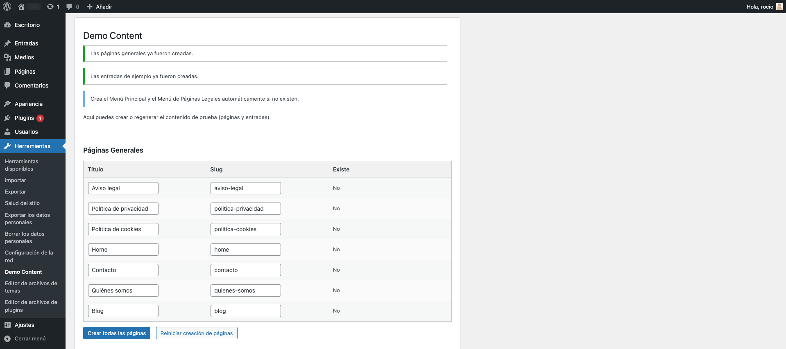
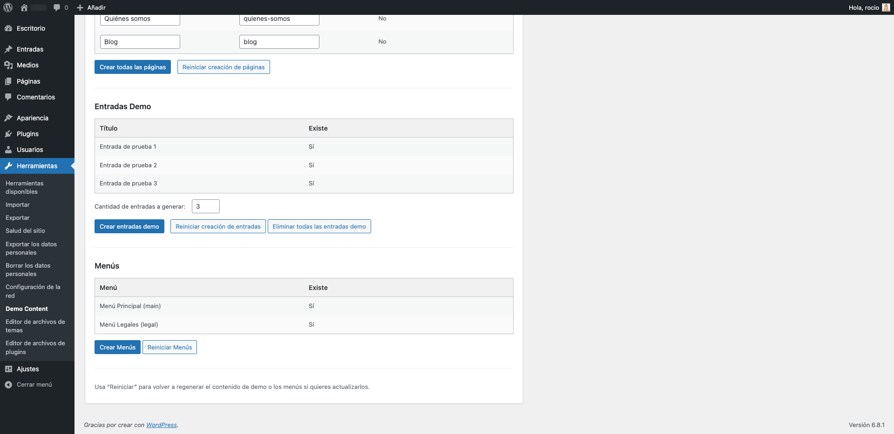
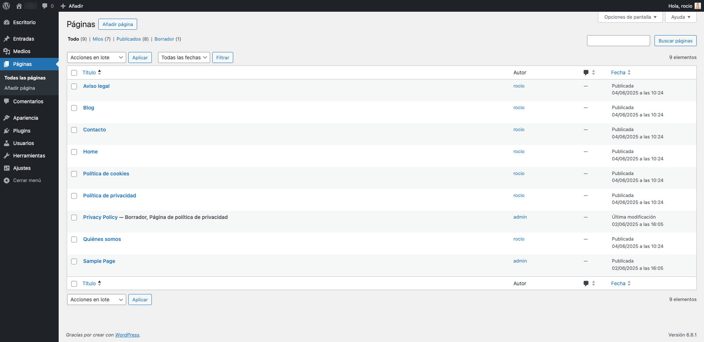
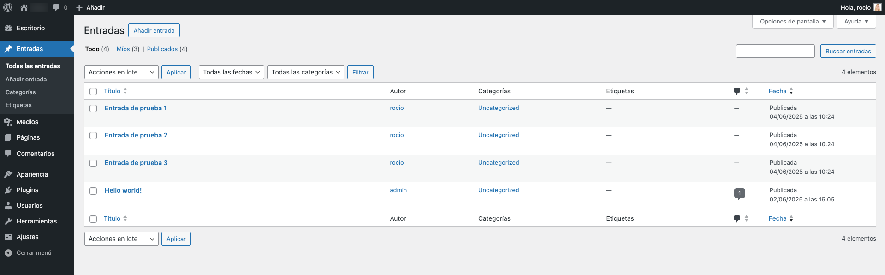

# Plugin WP: Custom Demo Content

**Custom Demo Content** es un plugin WP que genera automáticamente páginas, menús y entradas de ejemplo desde **Herramientas → Demo Content**.

## Características

- Páginas generales con título y slug editables.
- Entradas de demo con número configurable (1–50).
- Botón para eliminar todas las entradas demo.
- Menús “main” y “legal” creados automáticamente.
- UI AJAX sin recargar la página.

## Instalación

1. Clonar este repositorio en `wp-content/plugins/`.
2. Activar desde **Plugins → Custom Demo Content**.
3. Ir a **Herramientas → Demo Content** y usar los botones.

## Uso

- Edita títulos y slugs en “Páginas de Ejemplo”, pulsa “Crear…”
- Ajusta el número en “Cantidad de entradas a generar” y pulsa “Crear entradas…”
- “Eliminar todas las entradas demo” borra solo esas entradas
- “Crear Menús de Demo” genera los menús si no existen

## Screenshots

## Licencia

GPL v2 or later.
